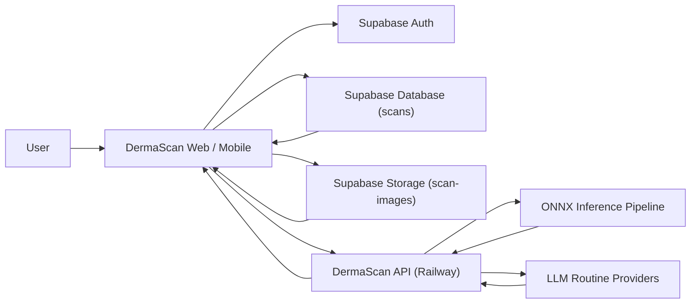
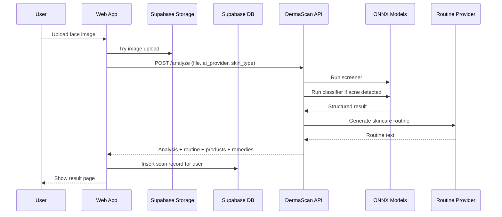

# DermaScan Architecture

This document explains how the DermaScan system is structured across the frontend, backend, data layer, and user flows.

## 1. System Overview

DermaScan is an AI-assisted skin analysis platform made of:

- a `web` app built with Next.js
- a `mobile` app built with Expo / React Native
- a `shared` workspace for shared client-side types and utilities
- a separate deployed backend API in the `dermascan-api` repository
- Supabase for authentication and scan persistence

At a high level, the platform accepts a face image, sends it to the backend for acne analysis, receives a structured result, stores the scan for the logged-in user, and renders follow-up insights such as routines, product suggestions, remedies, history, comparisons, and reports.

## 2. Repository Layout

### Main product workspace

Path: `D:\PROJECTS\dermascan`

```text
dermascan/
  mobile/      Expo mobile app
  shared/      Shared frontend-facing helpers and types
  web/         Next.js web dashboard
```

### Backend workspace

Path: `D:\PROJECTS\dermascan-api`

```text
dermascan-api/
  models/              ONNX models used for inference
  inference.py         Model loading and prediction pipeline
  skincare.py          LLM routine generation layer
  recommendations.py   Product and remedy recommendation catalog
  main.py              FastAPI entry point
```

## 3. High-Level Architecture



## 4. Frontend Architecture

## 4.1 Web app

Path: `D:\PROJECTS\dermascan\web`

The web app is the main dashboard-style product interface. It uses the Next.js App Router and is organized around route-level features.

Main responsibilities:

- authenticate users with Supabase
- collect and upload scan images
- call the DermaScan API
- store scan results for later retrieval
- render dashboards, history, comparisons, and reports
- manage user preferences such as skin type, reminders, and ingredient blacklist

### Important folders

```text
web/
  app/           Route-level pages
  components/    Shared UI and app shell components
  lib/           API client, Supabase client, data helpers, types
  public/        Static assets
```

### Important frontend modules

- `app/scan/page.tsx`
  Handles image upload, AI provider selection, API analysis request, and scan persistence.

- `app/results/page.tsx`
  Renders the structured analysis view, AI routine sections, recommended products, and home remedies.

- `app/progress/page.tsx`
  Displays the user’s scan history and progress chart.

- `components/app-shell.tsx`
  Provides the dashboard layout, sidebar navigation, and persistent medical disclaimer.

- `components/use-patient-data.ts`
  Central hook that gathers current user state, scan history, preferences, and subscription logic.

- `lib/api.ts`
  Frontend API client for `POST /analyze`.

- `lib/app-data.ts`
  Handles scan fetching, preference storage, local asset fallback, scan allowance rules, and helper formatting logic.

- `lib/supabase.ts`
  Initializes the Supabase browser client.

- `lib/types.ts`
  Defines the frontend contract for scan results, scan records, products, remedies, dermatologist data, and preferences.

## 4.2 Mobile app

Path: `D:\PROJECTS\dermascan\mobile`

The mobile app mirrors the core user journey on React Native / Expo. It is intended for mobile-first usage and shares the same conceptual backend:

- Supabase auth
- DermaScan API for analysis
- persistent scan history

The mobile app is a second client, not a separate backend system.

## 4.3 Shared workspace

Path: `D:\PROJECTS\dermascan\shared`

This workspace is intended for shared frontend logic and types that can be reused between `web` and `mobile`. Architecturally, this is where cross-client contracts should live to reduce duplication.

## 5. Backend Architecture

Path: `D:\PROJECTS\dermascan-api`

The backend is a FastAPI service deployed separately on Railway. It exposes a single main user-facing analysis endpoint and composes three backend concerns:

- computer vision inference
- LLM-generated skincare routine generation
- recommendation assembly for products and home remedies

### Main backend modules

- `main.py`
  Defines the FastAPI app, health routes, and `POST /analyze`.

- `inference.py`
  Loads ONNX models, preprocesses the image, runs prediction, and returns structured acne classification output.

- `skincare.py`
  Builds the LLM prompt and calls providers like Gemini, Groq, Cohere, Hugging Face, OpenRouter, plus combined/consensus modes.

- `recommendations.py`
  Returns product and home remedy recommendations based on acne type, tags, and skin type.

## 6. Scan Analysis Pipeline

The core scan pipeline is a staged flow.



### Step-by-step behavior

1. The user uploads a face image from the web or mobile client.
2. The frontend attempts to store the image in Supabase Storage for durable reuse.
3. The frontend sends the image to the backend `POST /analyze` endpoint.
4. The backend runs the ONNX screener model.
5. If acne is detected, the backend runs the classifier model.
6. The backend derives:
   - `is_acne`
   - `acne_type`
   - `confidence`
   - `severity`
   - `recommendation_tags`
   - `raw_scores`
7. The backend calls the chosen LLM provider to generate a routine.
8. The backend attaches product recommendations and home remedies.
9. The frontend stores the completed scan in Supabase.
10. The frontend renders the result and later retrieves it in history/progress views.

## 7. Inference Layer

The inference engine in `inference.py` is a two-stage ONNX pipeline.

### Stage 1: Screener

Purpose:

- determine whether acne is present at all

If the screener predicts no acne:

- the pipeline stops early
- the API returns a maintenance routine instead of a full acne workflow

### Stage 2: Classifier

Purpose:

- identify the acne class when acne is present

Current classes:

- `cystic`
- `open_comedone`
- `closed_comedone`

The classifier output is also used to derive:

- severity label
- recommendation tags for downstream routine/product/remedy logic

## 8. LLM Recommendation Layer

The LLM layer in `skincare.py` is separate from the image model itself.

Responsibilities:

- generate a readable skincare routine
- convert structured model output into user-friendly guidance
- support provider switching and fallback behavior

Supported provider modes:

- `gemini`
- `groq`
- `cohere`
- `huggingface`
- `openrouter`
- `combined`
- `consensus`

Design note:

The computer vision model decides the acne-related structured output. The LLM does not classify the image. It only turns structured results into actionable routine text.

## 9. Recommendation Layer

The recommendation layer in `recommendations.py` is a deterministic business layer on top of model output.

It uses:

- acne type
- recommendation tags
- user skin type

to return:

- `product_recommendations`
- `home_remedies`

This is important architecturally because these features are not part of the vision model itself. They are app-level recommendation features built on top of structured inference output.

## 10. Data Architecture

## 10.1 Supabase Auth

Supabase Auth is used for:

- user registration
- login/logout
- session retrieval in the client

The web app reacts to auth state changes and shows user-specific data once a session exists.

## 10.2 Supabase Database

The `scans` table is the primary persistence layer for user scan history.

Stored fields include:

- `user_id`
- `created_at`
- `is_acne`
- `acne_type`
- `confidence`
- `severity`
- `provider`
- `routine`
- `raw_scores`
- `image_url`

This table powers:

- history
- progress charts
- compare view
- dashboard metrics
- weekly reporting

## 10.3 Supabase Storage

The `scan-images` bucket is used for persistent image storage.

The web app tries to:

1. upload the original image to storage
2. store the returned public URL in the scan record

If that fails, the app keeps a smaller fallback image payload so the history view can still render a preview.

## 10.4 Browser-side local storage

Some user-specific, lower-risk preference data is stored locally in the browser:

- language
- reminders
- ingredient blacklist
- plan flag
- trial start date
- skin type
- dermatologist linking helpers

This layer is used for quick personalization and UI continuity.

## 11. Feature-to-Architecture Mapping

### Dashboard

Built from:

- Supabase scan history
- derived metrics in `lib/app-data.ts`
- latest scan snapshot

### New Scan

Built from:

- file upload UI
- backend analysis call
- storage upload
- scan DB insert

### Result page

Built from:

- most recent API response
- structured routine rendering
- API or fallback recommendations

### Progress

Built from:

- historical scan records
- charted severity trend
- stored image previews

### Compare

Built from:

- two or more saved scans
- derived confidence/severity deltas

### Weekly Report

Built from:

- recent scans
- aggregated metrics
- printable layout

### Products and Remedies

Built from:

- model output
- user skin type
- recommendation rules

### Dermatologist portal

Built from:

- linked patient code
- locally saved patient snapshots
- dermatologist notes/prescriptions

Current design note:

This dermatologist layer is presently a frontend-led experience and not yet a fully separate secure backend domain model.

## 12. Runtime Boundaries

The system is split across clear execution environments.

### Browser

Runs:

- Next.js client pages
- Supabase auth session usage
- scan upload UI
- local storage preferences

### Web server build/runtime

Runs:

- Next.js app routing and rendering

### Backend API server

Runs:

- FastAPI
- ONNX inference
- provider orchestration
- product/remedy assembly

### External provider APIs

Used by:

- Gemini
- Groq
- Cohere
- Hugging Face
- OpenRouter

## 13. Key Architectural Strengths

- clear separation between image inference and text generation
- structured scan result contract returned by the backend
- reusable product/remedy features built on top of the model output
- persistent scan history that supports progress, comparison, and reporting
- flexible multi-client design with both web and mobile apps

## 14. Current Architectural Risks / Gaps

- frontend preferences and dermatologist portal state still rely partly on local storage instead of a shared secure backend model
- product and remedy recommendations are catalog-driven, not yet connected to live product APIs
- image persistence depends on correct Supabase Storage and table configuration
- the API repository currently contains sensitive local files that should be handled carefully before deployment
- some shared logic still exists separately in `web` and `mobile` instead of fully converging through `shared`

## 15. Recommended Next Architectural Steps

1. Move more patient preferences and dermatologist data into Supabase tables.
2. Formalize shared types between `web`, `mobile`, and `dermascan-api`.
3. Add backend-backed roles for patients vs dermatologists.
4. Add a report-generation service or endpoint for weekly PDF summaries.
5. Add observability for failed scan inserts, storage upload failures, and API provider fallbacks.
6. Clean up deployment and secret management between the web and API repos.

## 16. Summary

DermaScan is architected as a layered AI application:

- the frontend owns user experience, history, and personalization
- Supabase owns auth and persistence
- the backend owns image inference and structured guidance assembly
- LLM providers turn classification output into readable routines

That separation is what makes features like progress tracking, product recommendations, remedies, comparison, and reporting possible without retraining the vision model for every new product feature.
